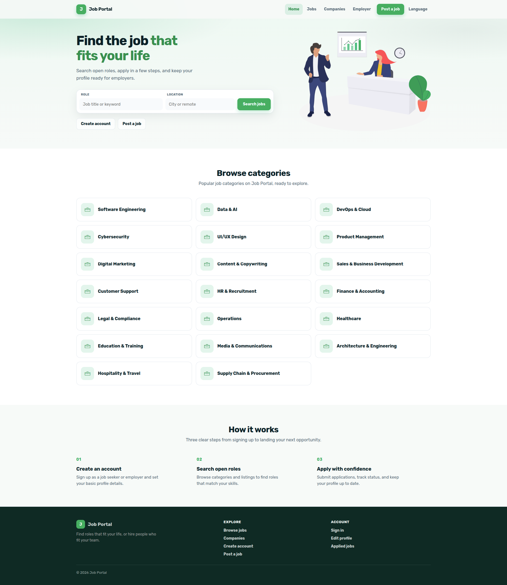
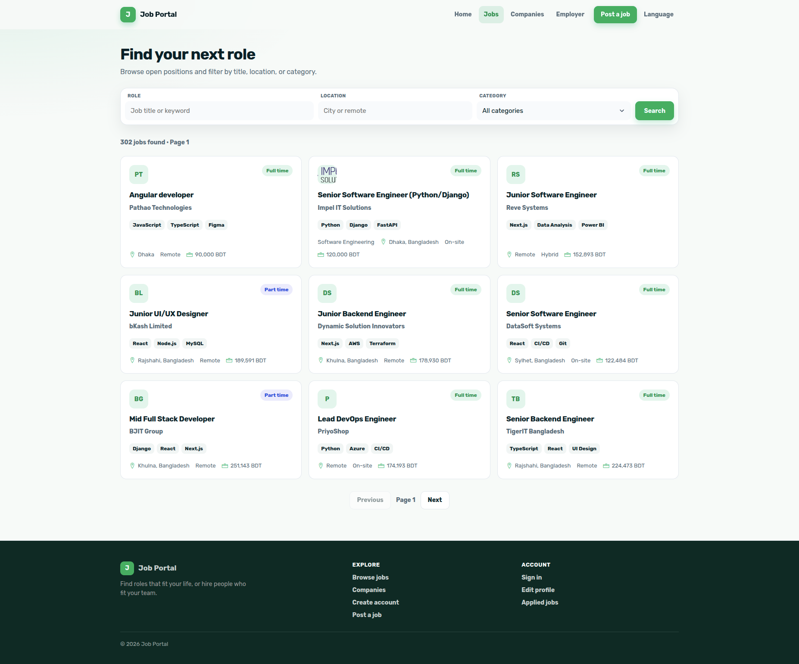
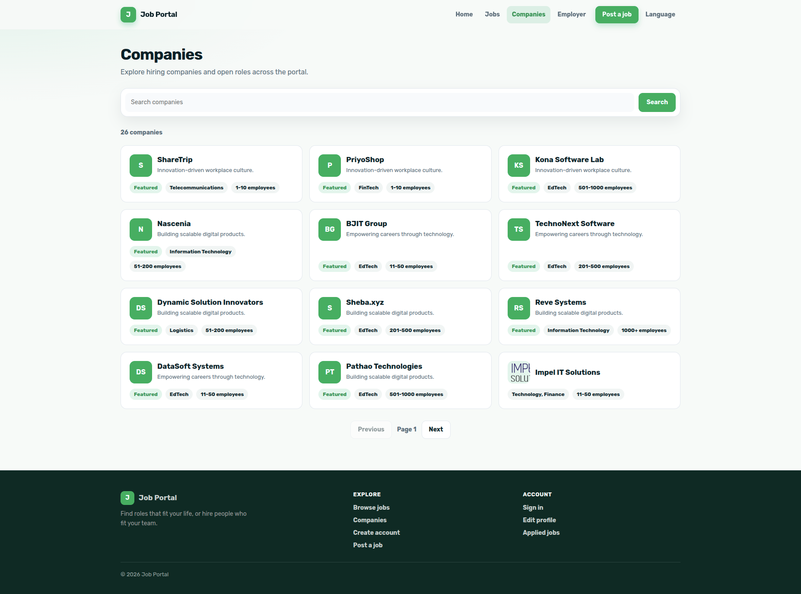

# Job Portal

A modern job portal application built with React, TypeScript, and a Django REST API backend. The app supports both job seekers and employers with separate protected routes, search and listing flows, profile management, and recruitment workflows.

## Screenshots

### Home page



### Jobs page



### Companies page



## Features

### Job seeker features

- Browse and search jobs by keyword, location, and category
- View detailed job listings and company information
- Apply to jobs and track applied positions
- View all applied jobs in one place
- Edit personal profile data such as first name, last name, and gender
- Search and browse companies

### Employer features

- Post new jobs
- Manage employer dashboard
- Review applicants for all jobs
- View applicants for a specific job
- Manage employer company profiles and related data

### Authentication and access control

- Register and log in with email/password
- Sign in using Google and Facebook social auth
- JWT-based authentication flow with token handling
- Protected employee and employer routes
- Logout flow with route redirect

### User experience

- Responsive navigation and mobile-friendly layout
- i18n support with English and Bengali translations
- Loading skeletons and spinners for async data
- Toast notifications for success and error feedback
- URL-driven filtering and pagination for job search results

## Tech stack

- React 19
- TypeScript
- react-router 8
- Axios
- Bootstrap 5
- i18next
- react-hot-toast
- react-helmet-async
- JWT decode utilities
- Create React App / react-scripts

## Requirements

- Node.js 22.22.0 or newer
- A running backend API for the job portal endpoints

## Getting started

1. Install dependencies:

    ```bash
    npm install
    ```

2. Start the app:

    ```bash
    npm start
    ```

3. Open the app in your browser:
    ```text
    http://localhost:3001
    ```

> The project is configured to run on port 3001 in the local development setup.

## Available scripts

### `npm start`

Runs the app in development mode.

### `npm test`

Launches the test runner in interactive watch mode.

### `npm run build`

Creates a production build in the `build` folder.

### `npm run eject`

Removes the default CRA setup and exposes the underlying build configuration.

## Project notes

This application is designed as a full-stack job portal frontend with clear separation between employee and employer experiences. It emphasizes a clean, practical user flow and role-based access to keep recruitment and job search experiences focused and straightforward.
